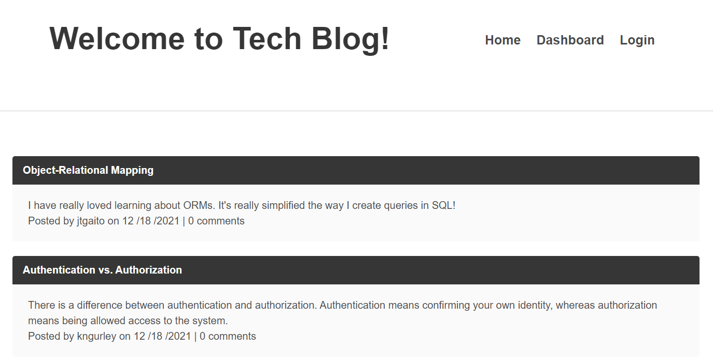

# tech-blog

## Description
An application in which a user can share thoughts and opinions on tech-related subjects through means of blogging. 
User can view all blog post. With credentials, user can create new blog posts and make comments on other user blog posts. 

## Depoloyed application
https://still-citadel-59357.herokuapp.com/

## Installation
To install this application:
1. Clone repository
1. Download npm dependencies with 'npm install' command
1. Update environment variables with local user and password
1. Invoke application start with 'npm start' command

## Technologies
- JavaScript
- Node.js
- Node package manager (npm)
	- Express
	- Express-session
	- Express-handlebars
	- Sequelize
	- mysql2
	- dotenv
	- bcrypt

## Preview

## Questions
Reach out to me on GitHub or contact me by email address.  
- [GitHub Profile](https://github.com/kngurley25)  
- kngurley25@gmail.com